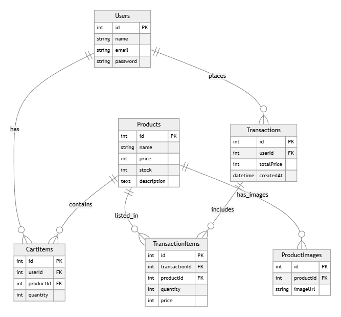

# 🛒 Grocery Mart Backend API

**Grocery Mart** is a RESTful API for a simple e-commerce application. This project demonstrates a complete backend flow from User Authentication, Product Management (with multiple image uploads), Shopping Cart logic, to Checkout and Transaction History.

Built with **Node.js**, **Express**, and **Sequelize** (MySQL).

---

## 🗺️ Entity Relationship Diagram (ERD)

Below is the database schema design used in this project:



*(Note: Ensure the file `ERD.png` is uploaded to your repository)*

---

## 🚀 Tech Stack

* **Runtime:** Node.js
* **Framework:** Express.js
* **Database:** MySQL
* **ORM:** Sequelize
* **Authentication:** JSON Web Token (JWT)
* **File Upload:** Multer (Support Multiple Files)

---

## ✨ Key Features

1.  **Authentication & Security** 🔐
    * User Registration & Login.
    * Protected endpoints using `Bearer Token` (JWT).
    * Data separation: Users can only access their own cart and transaction history.

2.  **Product Management** 📦
    * **Multiple Image Upload:** Admin can upload up to 5 images per product.
    * CRUD operations for products.
    * Detailed product view including stock and price.

3.  **Shopping Cart System** 🛒
    * Add items to personal cart.
    * Update quantity (increment/decrement).
    * Remove specific items.
    * View cart summary.

4.  **Transaction & Checkout** 💳
    * **Atomic Transactions:** Ensures stock is deducted only when payment is successful.
    * **Price Snapshot:** Records the product price *at the time of purchase* (even if the price changes later).
    * **History & Pagination:** View order history with page navigation.
    * **Transaction Detail:** View specific transaction details by ID.

---

## 🛠️ Installation & Setup

1.  **Clone the Repository**
    ```bash
    git clone [https://github.com/raytqr/grocery-mart-backend.git](https://github.com/raytqr/grocery-mart-backend.git)
    cd grocery-mart-backend
    ```

2.  **Install Dependencies**
    ```bash
    npm install
    ```

3.  **Environment Variables**
    Configure `config/config.json` with your database credentials.

4.  **Database Setup**
    ```bash
    # Create Database
    npx sequelize-cli db:create

    # Run Migrations (Create Tables)
    npx sequelize-cli db:migrate
    ```

5.  **Run the Server**
    ```bash
    # Development mode (with Nodemon)
    npx nodemon index.js
    ```
    Server runs at `http://localhost:3000`

---

## 📡 API Endpoints Documentation

### 👤 Authentication
| Method | Endpoint | Description | Auth |
| :--- | :--- | :--- | :--- |
| `POST` | `/auth/register` | Register a new user | No |
| `POST` | `/auth/login` | Login & receive JWT Token | No |

### 📦 Products
| Method | Endpoint | Description | Auth |
| :--- | :--- | :--- | :--- |
| `GET` | `/products` | Get all products | No |
| `GET` | `/products/:id` | Get product detail | No |
| `POST` | `/products` | Create product + **Upload Multiple Images** | **Yes** |

### 🛒 Shopping Cart
| Method | Endpoint | Description | Auth |
| :--- | :--- | :--- | :--- |
| `GET` | `/cart` | Get user's cart items | **Yes** |
| `POST` | `/cart` | Add product to cart | **Yes** |
| `PUT` | `/cart/:id` | Update item quantity | **Yes** |
| `DELETE` | `/cart/:id` | Remove item from cart | **Yes** |

### 💳 Transactions
| Method | Endpoint | Description | Auth |
| :--- | :--- | :--- | :--- |
| `POST` | `/cart/checkout` | Process payment & deduct stock | **Yes** |
| `GET` | `/cart/history` | View order history (with Pagination) | **Yes** |
| `GET` | `/cart/history/:id`| View specific transaction details | **Yes** |

---
---
*Created by Rayhan*